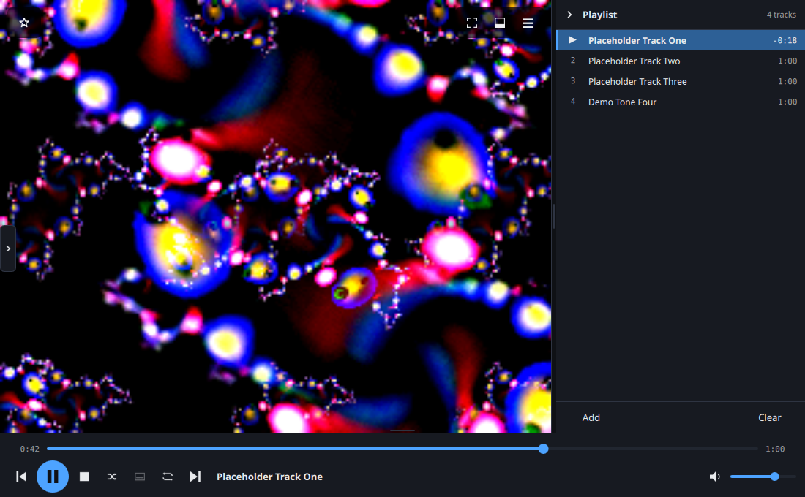
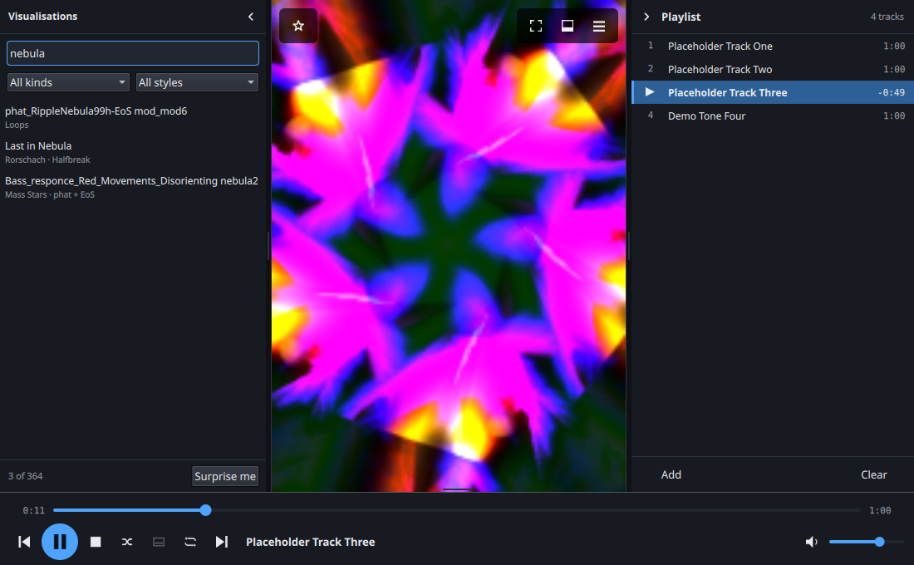
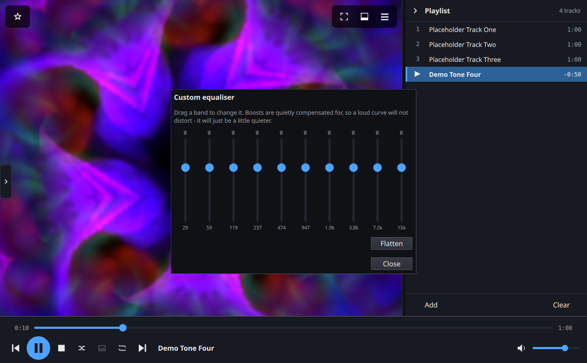

# Reverie Media Player

A media player for Linux with Milkdrop-style visualisations built in — not running alongside in a
second window, but rendered into the same scene as the rest of the interface.

It exists because the available options sit at two extremes: players that look like they were
designed in 2009, and library-management applications that happen to play audio. Reverie is
neither. It plays what you give it, shows something worth looking at while it does, and does not
try to organise your music collection.



<p align="center">
  
  
</p>

## What it does

- **Transport** — play, pause, stop, next, previous, seek, volume, shuffle, repeat that cycles
  off / playlist / one track, and a subtitles toggle
- **Visualisations** — projectM (Milkdrop) presets, embedded or fullscreen, driven by the decoded
  audio. The packages carry a curated **364**, two from each of the pack's 183 visual styles, and
  the full collection of **9,795** is an optional 2.7 MB download.
- **A browser for them**, in a panel beside the stage: search by name, filter by kind or by the
  pack's own visual style, and click to watch. Star the one you are looking at, and the
  right-click menu keeps your favourites and the last ten you saw — which matters more than it
  sounds, because the visualiser rotates on its own and that list is the only way back to the one
  that just went past.
- **Equaliser** — twelve preset curves and a ten-band custom mixer, with boosts compensated
  automatically so a loud curve cannot clip
- **One playlist** — drag to reorder, multi-select, remove, save and load M3U. Not tabbed
  playlists, not a library.
- **Video** — plays video on the same surface the visualiser uses, letterboxed, with the controls
  over it. **Hardware decoding** where the machine supports it.
- **Subtitles** — embedded tracks and external `.srt` files. A subtitle file sitting beside the
  video is found on its own; others can be added from the picture's right-click menu. Off by
  default, with a button in the transport.
- **Audio and subtitle tracks** — a file with a commentary track or two languages can be switched
  between, and a *preferred language* for each decides which is picked when a file offers a choice
- **Internet radio** — streams are entries in the same playlist, with station metadata in the
  now-playing line
- **Mini-player** — a compact always-on-top layout
- **A resizable window** — drag the divider to rebalance the playlist against the visualiser, and
  the top of the transport to make it taller; the controls scale with it
- **Themes** — follows the desktop's light/dark setting, with ten ready-made palettes and a
  five-colour custom editor, including the visualiser background and how strongly it tints
- **MPRIS** — media keys and desktop integration

**Deliberately not included:** library management, lyrics, social features, third-party service
integration.

## Adaptive visual quality

The visualiser renders to an offscreen buffer and upscales. On software rendering (llvmpipe) that
is the difference between usable and not: a heavy preset at 1280x720 runs around 10 fps at full
scale and around 20 fps at half. Reverie measures its own frame time and adjusts the render scale
to hold a target frame rate, stepping down quickly and back up slowly, because a visualiser whose
resolution visibly pumps is worse than one that is slightly soft.

You can override all of it in *Options > Visual quality*, including a fixed scale and the target
frame rate.

## Installing

Debian packages are attached to each [release](https://github.com/sandrewd/ReverieMediaPlayer/releases),
built for Ubuntu 24.04 and so also Linux Mint 22.x and Zorin OS 18:

```sh
sudo apt install ./reverie_*_amd64.deb
```

A Flatpak bundle is attached as well, and needs no matching distribution:

```sh
flatpak install --user ./reverie.flatpak
```

## Building

Requires Qt 6.4+, GStreamer 1.20+, TagLib, CMake 3.22+, and a C++17 compiler. Reverie also builds
against much newer Qt — the Flatpak uses 6.11.

On Debian/Ubuntu (24.04 or newer):

```sh
sudo apt install build-essential cmake git \
    qt6-base-dev qt6-declarative-dev libqt6svg6-dev \
    qml6-module-qtquick qml6-module-qtquick-controls qml6-module-qtquick-layouts \
    qml6-module-qtquick-dialogs qml6-module-qtquick-window qml6-module-qtqml-workerscript \
    libgstreamer1.0-dev libgstreamer-plugins-base1.0-dev \
    gstreamer1.0-plugins-good gstreamer1.0-plugins-bad gstreamer1.0-libav \
    libtag1-dev
```

**projectM is vendored and built alongside Reverie.** The version in Debian and Ubuntu is 2.1.0,
a 2012-era release, and is unusable. Reverie also depends on a projectM API that is not in any
tagged release yet: `projectm_opengl_render_frame_fbo()`. Every released projectM up to and
including 4.1.7 renders its final composite to framebuffer 0 regardless of what is bound, which
makes it impossible to draw into a Qt Quick scene graph — the item comes out black while still
costing the full frame time. So the submodule is pinned to a master commit.

```sh
git clone --recurse-submodules https://github.com/sandrewd/ReverieMediaPlayer.git
cd ReverieMediaPlayer

# Build the vendored projectM first
cmake -S vendor/projectm -B build/projectm-master \
      -DCMAKE_BUILD_TYPE=Release -DBUILD_SHARED_LIBS=ON -DENABLE_PLAYLIST=ON \
      -DCMAKE_INSTALL_PREFIX="$PWD/build/projectm-master-install"
cmake --build build/projectm-master -j"$(nproc)"
cmake --install build/projectm-master

# Then Reverie
cmake -S . -B build/player -DCMAKE_BUILD_TYPE=Release
cmake --build build/player -j"$(nproc)"
```

### A note on textures

Some Milkdrop presets name an external image — `worms`, `fw_clouds`, `PEcubesBW` — and load it as
a texture. **Reverie ships none of them, in the curated set or the full download, and that is
deliberate.**

Nothing breaks without them. projectM substitutes a 1×1 placeholder and the preset still renders;
measured across every curated preset that asks for one, 68 of 78 were unaffected enough to look
normal and exactly **one** turned out to depend on its texture completely. That one is not in the
curated set — nor are three others that render nothing whatever you give them. What you lose is
fidelity on part of the library, not the library.

What you would gain is not worth what it costs. A texture is decoded by `stb_image`, which is not
hardened against hostile input, and projectM's API accepts only a *search path* — there is no way
to hand it pixels decoded by something better. More to the point, the trust model is wrong: an
audio or video file is something you chose and opened, one at a time, whereas a texture pack
arrives from upstream and every user gets the same bytes without ever looking at them. Swapping
one image in a pack is trivial for whoever controls it, and reaches everybody at once. That is a
much easier thing to attack than a file a person deliberately went and played.

If you want them anyway, the path is open and always has been: put images in
`~/.local/share/reverie/textures` and they will be found. That is your decision about your own
machine, which is exactly where it belongs.

### Presets

The preset pack is **not** included in this repository — it is 157 MB and belongs to its own
project. Fetch it into `assets/presets/`:

```sh
git clone --depth 1 \
    https://github.com/projectM-visualizer/presets-cream-of-the-crop.git assets/presets
```

The build installs the presets listed in `assets/presets-curated.txt`: two from each of the
pack's 183 sub-folders, so every visual style it curates is represented. Within a style the
cheapest by static cost proxy is taken, which guarantees something a software renderer can
manage, and the median, which is what the style actually looks like. Point `--presets` at any
directory to use a different set.

Users of a built package do not need any of the above: *Options > Visualisation > Get more
visualisations…* downloads the complete collection, which is
[published as its own release](https://github.com/sandrewd/ReverieMediaPlayer/releases/tag/presets-v1)
and pinned by digest. It installs alongside the packaged set rather than over it, so switching
back is a menu item rather than a reinstall.

### Installing

```sh
sudo cmake --install build/player --prefix /usr/local
```

Or build a Debian package:

```sh
cmake --build build/player --target package
sudo apt install ./build/player/reverie_*_amd64.deb
```

### Flatpak

The manifest is `packaging/flatpak/io.github.sandrewd.ReverieMediaPlayer.yml`. It builds projectM
itself and takes TagLib and GStreamer from the KDE runtime:

```sh
flatpak install flathub org.kde.Platform//6.11 org.kde.Sdk//6.11
flatpak-builder --user --force-clean --repo=repo build-dir \
    packaging/flatpak/io.github.sandrewd.ReverieMediaPlayer.yml
```

## Status

Reverie is usable and in active development. Known gaps, stated plainly:

- **Wayland works but is less exercised than X11.** It has been run under both, and the mini-player
  in particular needed a Wayland-specific fix. Always-on-top for the mini-player is X11-only and
  cannot be done portably on Wayland.
- **On Wayland, double-clicking the title bar may not maximise the window** — with the Debian
  package, which builds against Qt 6.4. GNOME does not implement the xdg-decoration protocol, so
  Qt draws its own title bar, and 6.4's decoration handles the buttons but not that gesture; the
  maximise button beside it works normally. **The Flatpak is unaffected**, since it builds against
  a much newer Qt. For the `.deb`, `QT_QPA_PLATFORM=xcb` uses XWayland and the window manager's
  own decorations, where double-click behaves as expected.
- **The performance figures above assume software rendering.** On a machine with a working GPU
  everything is considerably faster than they suggest.

## Diagnostics

A normal run prints a handful of lines: where the presets came from, what the audio chain did,
which output sink was chosen, and any warnings. If something needs investigating, the detailed
instrumentation is an environment variable away rather than a rebuild:

```sh
QT_LOGGING_RULES='reverie.*.debug=true' reverie    # frame times, render scale, preset changes
PLAYER_AUDIO_SINK=pulsesink reverie                # force a specific GStreamer audio sink
PLAYER_BUS_TRACE=1 reverie                         # every GStreamer bus message
PLAYER_NO_HW_DECODE=1 reverie                      # software decoding only
```

### Hardware decoding

It is automatic where the machine supports it — confirmed on Intel hardware, where an H.264 file
decodes through `vah264dec`. Reverie names the decoder it chose on startup, so you can tell rather
than guess:

```
decoder: vah264dec (Codec/Decoder/Video/Hardware)  [hardware]
decoder: avdec_h264 (Codec/Decoder/Video)
```

The GStreamer side needs nothing installed — the `va` plugin is part of `gstreamer1.0-plugins-bad`,
already a dependency, and it registers no elements at all on a machine without a capable device.
What such a machine is missing is the libva driver, which the package **recommends**
(`va-driver-all`) rather than depends on, since software decoding works fine without it.

If video misbehaves on a machine with a flaky VA driver, `PLAYER_NO_HW_DECODE=1` demotes the
hardware decoders so they are never chosen.

## Licence

Reverie is released under the [MIT licence](LICENSE).

## Attributions

Reverie links dynamically against the following, all under their own licences:

| Project | Licence |
|---|---|
| [Qt 6](https://www.qt.io/) | LGPL-3.0 |
| [GStreamer](https://gstreamer.freedesktop.org/) | LGPL-2.1 |
| [projectM](https://github.com/projectM-visualizer/projectm) | LGPL-2.1, with bundled projectm-eval and hlslparser under MIT |
| [TagLib](https://taglib.org/) | LGPL-2.1 / MPL-1.1 |

The bundled presets are the Milkdrop **“Cream of the Crop”** collection, curated and sorted by
**ISOSCELES** and distributed with projectM. Per that collection's own notice, the presets were in
almost all cases never released under a specific licence and are treated as public domain, with
each preset author retaining copyright in their own work. If you are a preset author and do not
want your work included, the projectM team removes presets on request.

Milkdrop was created by Ryan Geiss. projectM is an independent reimplementation.
